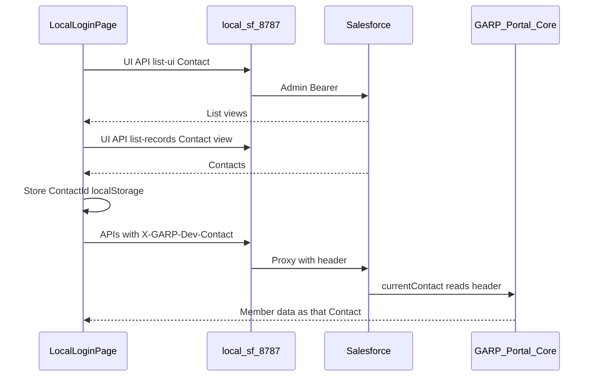

# Local Dev Contact Picker

Localhost-only workflow: pick a Contact on the login page (via `local-sf` + admin CLI token), then act as that member for portal APIs.

### Local-only vs build / Experience

| Layer | Ships in UI Bundle build? | Active on Experience? | Notes |
|---|---|---|---|
| Contact picker UI (`AuthLocalTools`) | Source is in the bundle | **No** | Gated by `isLocalCliAuthEnabled()` → `isLocalViteHost()` (`localhost` / `127.0.0.1` only) |
| `X-GARP-Dev-Contact` header inject | Same | **No** | No-op unless localhost Vite |
| `local-sf` gateway (`tools/local-dev`) | Not part of Experience deploy | N/A | Binds `127.0.0.1` only on your machine |
| Apex `GARP_Portal_Core` header read | N/A (org metadata) | Deployed to org | Standard users only; **remove or kill-switch before prod** |

UI is inert on Experience (hostname is never localhost). Apex is org-deployed — keep the snippet below if backend overwrites the class.

## Prerequisites

```bash
sf org login web --alias devjuly25a
npm run local-sf   # terminal 1 — gateway :8787
npm run local-ui   # terminal 2 — Vite :5173
```

Open http://localhost:5173 → Login → top-left **Users** icon (beside theme toggle) → Contact picker dialog.

1. **Search lists…** — filter list-view names (like Lightning “Search lists…”)
2. **List view** — org Contact list view (UI API; e.g. Exam Results FRM, FRM Certified)
3. **Search Contacts** — `searchTerm` within that view
4. Click a Contact to enter

## Architecture



## Phase 1 — Frontend (React)

| Piece | Location |
|---|---|
| List views + Contacts (UI API) | `src/auth/local-dev-contacts.ts` |
| Selected Contact Id storage | `localStorage` key `garp.localDev.contactId` |
| Selected list view | `localStorage` key `garp.localDev.listViewApiName` |
| Login chrome (theme + dialog) | `src/components/molecules/auth-local-tools.tsx` |

**Click a Contact:** stores Id, seeds React Query `currentUser`, navigates into the app.

**Continue with Salesforce CLI:** no picker selection required; uses org Apex default fallback when Phase 2 header is absent.

## Phase 2 — Header + Apex

### Header contract

| Name | Value |
|---|---|
| `X-GARP-Dev-Contact` | Salesforce Contact Id (`003…`) |

- Browser / `localSfFetch` attaches the header when a Contact is selected (localhost only).
- [`tools/local-dev/server.mjs`](../tools/local-dev/server.mjs) forwards the header to Salesforce.
- Apex reads it only for **Standard** (internal) users with no `User.ContactId`.

### Apex (`GARP_Portal_Core`)

Behavior:

1. If community/guest and no ContactId → refuse (unchanged).
2. If Standard and no ContactId:
   - Prefer valid `X-GARP-Dev-Contact` when the Contact exists (`contactIdFromDevHeader()`).
   - Else `DEV_FALLBACK_CONTACT` (`003gP000009J6u3QAC`).
3. Log a diagnostic note when override or fallback applies.

Source class: MyGarp / org `GARP_Portal_Core` (not checked in under `garp_portal` as `.cls`). Path in sibling repo: `MyGarp/force-app/main/default/classes/GARP_Portal_Core.cls`.

**Redeploy snapshot** — if a backend developer overwrites the class, restore these pieces (`DEV_FALLBACK_CONTACT`, `contactIdFromDevHeader()`, and the Standard-user branch inside `currentContact()`):

```apex
@TestVisible
private static final Id DEV_FALLBACK_CONTACT = '003gP000009J6u3QAC';

/**
 * Local-dev override: browser / local-sf sends X-GARP-Dev-Contact with a
 * Contact Id. Only consulted for Standard (internal) users in
 * currentContact(). Community and guest never reach this helper for
 * impersonation. Remove or kill-switch before production.
 */
@TestVisible
private static Id contactIdFromDevHeader() {
    if (RestContext.request == null) {
        return null;
    }
    Map<String, String> headers = RestContext.request.headers;
    if (headers == null || headers.isEmpty()) {
        return null;
    }
    String raw = headers.get('X-GARP-Dev-Contact');
    if (String.isBlank(raw)) {
        raw = headers.get('x-garp-dev-contact');
    }
    if (String.isBlank(raw)) {
        return null;
    }
    try {
        Id candidate = (Id) raw.trim();
        if (candidate.getSObjectType() != Contact.SObjectType) {
            return null;
        }
        List<Contact> found = [
            SELECT Id
            FROM Contact
            WHERE Id = :candidate
            LIMIT 1
        ];
        return found.isEmpty() ? null : found[0].Id;
    } catch (Exception e) {
        return null;
    }
}

public static Contact currentContact() {
    if (cachedContact != null) {
        return cachedContact;
    }
    List<User> users = [
        SELECT Id, ContactId
        FROM User
        WHERE Id = :UserInfo.getUserId()
        LIMIT 1
    ];
    Id contactId = users.isEmpty() ? null : users[0].ContactId;

    if (contactId == null) {
        // 'Standard' is the internal licence. Every community licence -
        // CspLitePortal, PowerPartner, CsnOnly - and the guest user report
        // something else, so none of them can take this branch.
        if (UserInfo.getUserType() != 'Standard') {
            throw new PortalException('No member record is linked to the signed-in user.');
        }
        Id overrideId = contactIdFromDevHeader();
        if (overrideId != null) {
            contactId = overrideId;
            GARP_Portal_Diagnostics.note(
                'Internal session: X-GARP-Dev-Contact override ' + contactId);
        } else {
            contactId = DEV_FALLBACK_CONTACT;
            GARP_Portal_Diagnostics.note(
                'Internal session: acting as the development member ' + contactId);
        }
    }

    cachedContact = queryContact(contactId);
    return cachedContact;
}
```

## Security

| Rule | Why |
|---|---|
| UI only on localhost Vite | Never shown on Experience |
| Apex only for `UserType == 'Standard'` | Community/guest cannot impersonate |
| Validate Contact Id exists | Bad header → fallback, not crash |
| Remove or kill-switch before prod | Header must be a no-op in production |

**Before production:** remove the Apex override, or gate with Custom Permission / CMDT set false in prod. Do not rely on “sandbox only” deploys alone.

## Status

| Phase | Status |
|---|---|
| 1 — Contact list + select on login | Implemented in `garp_portal` UI Bundle |
| 2 — Header forward + Apex read | Implemented (gateway + Apex in MyGarp / GarpAppv1) |

## Related

- [local-cli-dev.md](./local-cli-dev.md) — gateway basics
